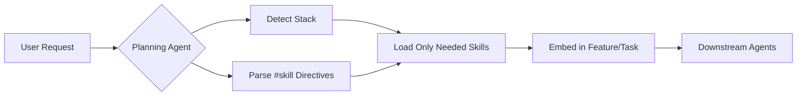

# SDLC Agents

**Build software that stays maintainable.**

[](./docs/AGENT_ARCHITECTURE.md)
[](./tools/github-copilot/README.md)
[](./tools/claude/README.md)
[](./tools/cursor/README.md)
[](./tools/windsurf/README.md)
[](./tools/aider/README.md)

---

## The Problem

LLMs write code fast—but they also generate **hidden costs**:

| 🚨 Problem | What Happens |
|-----------|--------------|
| **Structural Debt** | Code violates architectural boundaries. Coupling creeps in unnoticed. |
| **Generative Debt** | Quick fixes today become expensive rewrites tomorrow. |
| **Amnesia** | The same mistakes repeat across tasks—agents don't learn. |
| **Context Management** | Naive prompt stuffing wastes tokens and dilutes attention. |

**Result**: Your codebase degrades faster than you can refactor.

---

## The Solution

**SDLC Agents** bring engineering discipline to AI-assisted development through **advanced context engineering**:

```
Planning → Architect → Coding → Code Review → Retro
```

> 💡 **Token Efficiency**: By loading only relevant context per task, SDLC Agents significantly reduce token consumption while improving model focus and output quality.

Each phase has a **specialized agent** that does one thing well:

| Agent | What It Does |
|-------|--------------|
| 🏗️ [Initializer](./docs/agents/initializer-agent.md) | Sets up project structure and discovers existing architecture |
| 📋 [Planning](./docs/agents/planning-agent.md) | Converts requirements into structured, implementable plans |
| 🧭 [Architect](./docs/agents/architect-agent.md) | Validates plans against architectural rules *before* coding |
| 💻 [Coding](./docs/agents/coding-agent.md) | Implements incrementally, following the approved plan |
| 🔍 [Code Review](./docs/agents/codereview-agent.md) | Catches debt, security issues, and architectural violations |
| 📖 [Retro](./docs/agents/retro-agent.md) | Extracts lessons to prevent future mistakes |
| 🗃️ [Curator](./docs/agents/curator-agent.md) | Maintains knowledge quality over time |

### Key Principles

- **Architecture-First**: Structure is validated *before* code is written
- **Continual Learning**: Lessons from past work inform future decisions
- **Progressive Disclosure**: Agents load only what they need, staying focused
- **Automated Guardrails**: Rules are enforced, not just documented

---

## Core Capabilities

What makes SDLC Agents different from other AI coding assistants:

| Capability | What It Means | Token Impact |
|------------|---------------|---------------|
| 🎯 **Progressive Disclosure** | Agents load only contextually relevant knowledge—no bloated prompts | **↓ 60-80% fewer tokens** vs. full-context |
| 🧠 **Self-Learning** | Retro agent captures lessons; knowledge accumulates across tasks | Reuses learnings without re-explaining |
| 🔌 **Extension Support** | Add custom skills without modifying core agent files | Load extensions only when relevant |
| ⚡ **Dynamic Skill Selection** | Use `#SkillName` to include, `!SkillName` to exclude skills | **On-demand loading** saves tokens |
| 🏗️ **Architecture-First** | Structure is validated before implementation begins | Prevents costly rework iterations |
| 🤝 **Multi-Agent Orchestration** | Specialized agents with clear handoffs and responsibilities | Each agent loads minimal context |

### How Skills Work



### Example: Dynamic Skill Selection

```bash
# Use TDD pattern for this implementation
"Implement user authentication #TDD"

# Use spec-driven development with Java stack
"Add order processing API #spec-driven #java"

# Exclude a skill you don't need
"Add event processing !Kafka"
```

See [Skills Documentation](./docs/skills/README.md) for the full skill system.

---

## Quick Start

**1.** Clone or download SDLC Agents:
```bash
git clone https://github.com/dsilahcilar/sdlc-agents.git
```

**2.** Run the installer for your AI tool:
```bash
./install.sh --ghcp --target /path/to/your/project    # GitHub Copilot
./install.sh --claude --target /path/to/your/project  # Claude Code
./install.sh --cursor --target /path/to/your/project  # Cursor
./install.sh --all --target /path/to/your/project     # All tools
```

**3.** Run the **Initializer Agent** to set up your project structure.

**4.** Start with the **Planning Agent** for your first task.

See [Multi-Assistant Support](./docs/MULTI_ASSISTANT_SUPPORT.md) for detailed setup guides.

---

## Custom Extensibility

Extend agent behavior **without modifying core agent files**.

After initialization, your project includes an `extensions/` folder:

```
agent-context/extensions/
├── _all-agents/        # Rules applied to ALL agents
│   └── *.md
├── coding-agent/       # Rules for Coding Agent only
│   └── *.md
├── architect-agent/    # Rules for Architect Agent only
│   └── *.md
├── skills/             # Custom project skills
│   ├── domain/         # Domain-specific knowledge
│   └── patterns/       # Architecture patterns
└── ...                 # (one folder per agent)
```

### How It Works

1. Drop a `.md` file into the appropriate folder
2. Agents automatically read and apply these instructions
3. Custom rules **take precedence** over core behavior on conflict

### Example Use Cases

| Extension File | Purpose |
|----------------|---------|
| `_all-agents/security-policy.md` | Enforce security rules across all agents |
| `coding-agent/style-guide.md` | Team coding conventions |
| `architect-agent/company-standards.md` | Company-wide architecture decisions |

See [`extensions/README.md`](./agents/templates/extensions/README.md) for detailed examples.

---

## Documentation

| 📄 Document | Description |
|------------|-------------|
| [Multi-Assistant Support](./docs/MULTI_ASSISTANT_SUPPORT.md) | Setup for Copilot, Claude, Cursor, Windsurf, Aider |
| [Skills System](./docs/skills/README.md) | Progressive disclosure, skill directives, custom skills |
| [Agent Architecture](./docs/AGENT_ARCHITECTURE.md) | System design, file lifecycle, data flow |
| [Agent Responsibilities](./docs/AGENT_RESPONSIBILITY_ALLOCATION.md) | Context providers vs. consumers |
| [Individual Agents](./docs/agents/README.md) | Detailed specs for each agent |
| [Comparison with Spec-Kit](./docs/COMPARISON_WITH_SPEC_KIT.md) | When to use SDLC Agents vs. Spec-Kit |

---

<p align="center">
  <i>Works with GitHub Copilot, Claude, Cursor, Windsurf, and Aider</i>
</p>
