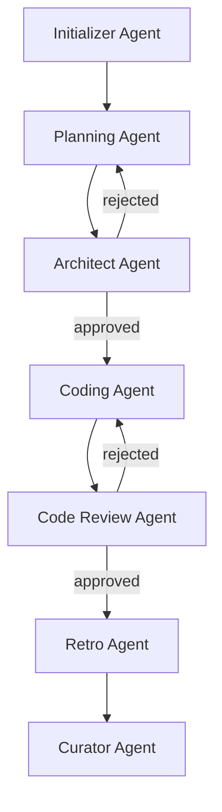

# SDLC Agent Architecture Documentation

> A comprehensive guide to the multi-agent system for continual learning SDLC around GitHub Copilot

**Last Updated:** 2024-12-08

---

## Table of Contents

1. [Executive Summary](#executive-summary)
2. [Design Principles](#design-principles)
3. [Agent Overview](#agent-overview)
4. [Tools & Skills System](#tools--skills-system)
5. [File Lifecycle](#file-lifecycle)
6. [Agent Dependencies](#agent-dependencies)
7. [Data Flow Diagrams](#data-flow-diagrams)
8. [Anti-Patterns & Escalation](#anti-patterns--escalation)

---

## Executive Summary

This framework addresses four key problems with AI-assisted development:

| Problem | Description | Solution |
|---------|-------------|----------|
| **Structural Debt** | LLMs generate code that works but violates architectural principles | Architecture-as-Guardrail with deterministic validation |
| **Generative Debt** | Quick solutions create expensive rework later | Explicit debt tracking and follow-up tasks |
| **Lack of Learning** | Agents repeat the same mistakes without improvement | Evolving playbook with curated lessons |
| **Brevity Bias** | Over-compressed context causes recurring errors | Rich context through progressive disclosure |

---

## Design Principles

### 1. Separation of Concerns

Each agent has a **single, focused responsibility**:

```
Initializer → Sets up project (scaffolding + discovery)
Planning    → Creates structured plans (no code)
Architect   → Validates structure (no implementation)
Coding      → Implements incrementally (no planning)
Review      → Evaluates changes (no implementation)
Retro       → Extracts lessons (no code changes)
Curator     → Maintains quality (no learning extraction)
```

### 2. Progressive Disclosure

> "Like a well-organized manual that starts with a table of contents, then specific chapters, and finally detailed appendix."

```
Level 1: Table of Contents  → skills/README.md (~100 tokens)
Level 2: Stack Detection    → skills/stack-detection.md (~200 tokens)
Level 3: Skill File         → skills/stacks/<stack>.md (~400 tokens)
Level 4: Tool Execution     → tools/<category>/<tool>.md (~100 tokens)

Total: ~800 tokens vs. ~4000+ if loading everything
```

### 3. Context Providers vs. Context Consumers

| Type | Agents | Responsibility |
|------|--------|----------------|
| **Context Providers** | Initializer, Planning | Detect stack, document in artifacts |
| **Context Consumers** | Architect, Coding, Code Review, Retro, Curator | Receive pre-assembled context |

### 4. Architecture-as-Guardrail

Architectural rules are defined in code, not documentation:

```
Architecture Tests (ArchUnit, dependency-cruiser, etc.) = Source of Truth
     ↓
Agents read tests directly to understand rules
     ↓
./harness/run-arch-tests.sh validates compliance
```

### 5. Fail Fast & Document

Stop and escalate when:
- Architecture tests fail
- Implementation reveals plan is incorrect
- Required context is missing
- Scope creep detected

**Stopping is not failure. Unlogged problems are failure.**

---

## Agent Overview

### Agent Workflow Diagram

```
┌─────────────────────────────────────────────────────────────────────────────┐
│                           SDLC Agent Workflow                                │
├─────────────────────────────────────────────────────────────────────────────┤
│                                                                              │
│         ┌──────────────────────────────────────────────────┐                │
│         │  Initializer Agent                                │                │
│         │  (one-time setup + architecture discovery)        │                │
│         └──────────────────────────────────────────────────┘                │
│                   │                                                          │
│                   ▼                                                          │
│  ┌──────────────┐    ┌──────────────┐    ┌──────────────┐                  │
│  │  Planning    │───▶│  Architect   │───▶│   Coding     │                  │
│  │   Agent      │    │    Agent     │    │    Agent     │                  │
│  └──────────────┘    └──────────────┘    └──────────────┘                  │
│         │                    │                   │                          │
│         │                    ▼                   ▼                          │
│         │            (rejected → revise)  ┌──────────────┐                 │
│         │                               │  Code Review │                   │
│         │                               │    Agent     │                   │
│         │                               └──────────────┘                   │
│         │                                        │                          │
│         ▼                                        ▼                          │
│  ┌──────────────────────────────────────────────────────┐                  │
│  │                    Retro Agent                        │                  │
│  │            (Learns from completed work)               │                  │
│  └──────────────────────────────────────────────────────┘                  │
│                              │                                              │
│                              ▼                                              │
│  ┌──────────────────────────────────────────────────────┐                  │
│  │                   Curator Agent                       │                  │
│  │           (Maintains knowledge quality)               │                  │
│  └──────────────────────────────────────────────────────┘                  │
│                                                                              │
└─────────────────────────────────────────────────────────────────────────────┘
```

### Quick Reference Table

| Agent | Role | Code Access | Runs When | Docs |
|-------|------|-------------|-----------|------|
| **Initializer** | Project setup + architecture discovery | Read-only | Once per project | [Details](./agents/initializer-agent.md) |
| **Planning** | Requirements → Plan | None | Start of each task | [Details](./agents/planning-agent.md) |
| **Architect** | Structural review | None | After planning | [Details](./agents/architect-agent.md) |
| **Coding** | Implementation | Read/Write | After approval | [Details](./agents/coding-agent.md) |
| **Code Review** | Change evaluation | Read-only | After coding | [Details](./agents/codereview-agent.md) |
| **Retro** | Learning extraction | None | After completion | [Details](./agents/retro-agent.md) |
| **Curator** | Knowledge quality | None | Periodically | [Details](./agents/curator-agent.md) |

### Stack Detection Responsibility

| Agent | Detects Stack? | Notes |
|-------|----------------|-------|
| Initializer | ✅ Yes | Detects and documents in artifacts |
| Planning | ✅ Yes | Detects and documents in Solution Plan |
| Architect | ❌ No | Receives from Solution Plan Section 1.1 |
| Coding | ❌ No | Receives from Context file |
| Code Review | ❌ No | Receives from Solution Plan + Context |
| Retro | N/A | Not relevant |
| Curator | N/A | Not relevant |

📖 **For detailed agent documentation, see the [agents/](./agents/) directory.**

---

## Tools & Skills System

### Tools Directory Structure

```
tools/
├── README.md              # Tool registry (table of contents)
├── discovery/             # Codebase analysis tools
│   ├── list-packages.md/sh
│   ├── find-imports.md/sh
│   ├── detect-layers.md/sh
│   └── count-files.md/sh
├── validation/            # Architecture validation
│   ├── check-circular.md/sh
│   └── check-layers.md/sh
└── stack/                 # Stack-specific tools
    ├── java/
    │   ├── archunit.md/sh
    │   └── jdeps.md/sh
    └── ts/
        ├── depcruise.md/sh
        └── madge.md/sh
```

### Tool Usage Pattern

```
1. READ tools/README.md (registry)
2. FIND relevant tool by category
3. READ tools/<category>/<tool>.md (description)
4. EXECUTE tools/<category>/<tool>.sh (script)
```

### Skills Directory Structure

```
skills/
├── README.md              # Table of contents (~100 tokens)
├── stack-detection.md     # Detection rules (~200 tokens)
└── stacks/                # Stack-specific skills (~400 tokens each)
    ├── java.md
    ├── typescript.md
    ├── python.md
    ├── go.md
    ├── rust.md
    ├── dotnet.md
    ├── ruby.md
    └── php.md
```

### Stack Detection Rules

| File | Stack | Skill |
|------|-------|-------|
| `pom.xml` | Java (Maven) | `stacks/java.md` |
| `build.gradle(.kts)` | Java/Kotlin (Gradle) | `stacks/java.md` |
| `package.json` | TypeScript/JS | `stacks/typescript.md` |
| `pyproject.toml` / `setup.py` | Python | `stacks/python.md` |
| `go.mod` | Go | `stacks/go.md` |
| `Cargo.toml` | Rust | `stacks/rust.md` |
| `*.csproj` / `*.sln` | C#/.NET | `stacks/dotnet.md` |
| `Gemfile` | Ruby | `stacks/ruby.md` |
| `composer.json` | PHP | `stacks/php.md` |

---

## File Lifecycle

### Project Workspace Structure

```
your-project/agent-context/
├── features/                      # Created by Planning Agent
│   └── FEAT-001/
│       ├── feature.md             │  → Feature context and metadata
│       │                          │  → Reviewed by Architect Agent
│       └── tasks/
│           ├── T01-xxx.md         │  → Self-contained task for Coding Agent
│           └── T02-xxx.md
│
├── harness/                       # Created by Initializer Agent
│   ├── init-project.sh            # Run once to set up environment
│   ├── run-feature.sh             # Run per-feature by Coding Agent
│   ├── run-arch-tests.sh          # Run after changes by Coding Agent
│   ├── run-quality-gates.sh       # Run before review
│   ├── next-task.sh               # Get next pending task
│   ├── start-task.sh              # Mark task as in_progress
│   ├── complete-task.sh           # Mark task as done
│   ├── list-features.sh           # Show feature status
│   └── progress-log.md            # Updated by ALL agents
│
├── memory/                        # Created by Initializer Agent
│   ├── learning-playbook.md       │  → Read by Planning Agent (filtered)
│   │                              │  → Written by Retro Agent
│   │                              │  → Curated by Curator Agent
│   └── archive/                   # Archived entries (by Curator)
│
│   # Note: Guardrails (like generative-debt-checklist.md, contamination-guidelines.md)
│   # are static references in agents/guardrails/, not copied per project
│
├── context/                       # Created by Initializer Agent
│   ├── domain-heuristics.md       # Domain-specific patterns
│   └── risk-patterns.md           # Common failure modes
│
└── docs/                          # Created by Architecture Discovery
    └── architecture-discovery-report.md
```

### File Lifecycle Diagram

```
                    INITIALIZER AGENT
                           │
           ┌───────────────┼───────────────┐
           ▼               ▼               ▼
       harness/        memory/        features/
         │               │           (templates)
         ▼               │                │
    PLANNING AGENT ──────┼────────────────┤
         │               │                │
         ├──────────▶ (reads playbook)    │
         │               │                │
         ▼               │                │
    features/<id>/       │                │
    ├── feature.md       │                │
    └── tasks/           │                │
        ├── T01.md       │                │
        └── T02.md       │                │
         │               │                │
         ▼               │                │
 ARCHITECT AGENT ────────┼────────────────┤
   (reviews feature.md)  │                │
         │               │                │
         ▼               │                │
 CODING AGENT ───────────┼────────────────┤
   (reads task files)    │                │
         │               │                │
         │    (updates   │                │
         │    progress-log)               │
         ▼               │                │
 CODE REVIEW AGENT ──────┼────────────────┘
         │               │
         ▼               │
   RETRO AGENT ──────────┤
         │               │
         │       (writes lessons)
         │               │
         ▼               ▼
  CURATOR AGENT ──────▶ memory/
              (curates playbook)
```

---

## Agent Dependencies

### Direct Dependencies



### Information Flow

| From | To | What's Passed |
|------|-----|---------------|
| Initializer | Planning | Harness, templates, memory structure, discovery report (if legacy) |
| Planning | Architect | `features/<id>/feature.md` for review |
| Planning | Coding | `features/<id>/tasks/T<NN>.md` (self-contained task files) |
| Architect | Coding | Approval/rejection of feature.md |
| Coding | Code Review | Changed files, progress log |
| Code Review | Coding | Review findings, required changes |
| Code Review | Retro | Review findings, observations |
| Retro | Curator | New learning entries |
| Curator | Planning | Curated playbook (via retrieval) |

### Escalation Paths

| Situation | From Agent | To Agent |
|-----------|------------|----------|
| Missing stack context | Coding | Planning |
| Plan rejection | Architect | Planning |
| Architecture violation (non-trivial) | Coding | Architect |
| Review rejection | Code Review | Coding |
| Uncertain lesson quality | Retro | Curator |
| Conflicting lessons | Curator | Human |

---

## Data Flow Diagrams

### Knowledge Loop

```
┌──────────────────────────────────────────────────────────────────┐
│                        KNOWLEDGE LOOP                             │
├──────────────────────────────────────────────────────────────────┤
│                                                                   │
│                    ┌─────────────────┐                           │
│                    │ learning-       │                           │
│              ┌────▶│ playbook.md     │◀────┐                     │
│              │     └─────────────────┘     │                     │
│              │              │              │                     │
│         (curate)       (retrieve)     (learn)                    │
│              │              │              │                     │
│   ┌──────────┴──┐    ┌──────▼──────┐   ┌──┴──────────┐          │
│   │   Curator   │    │  Planning   │   │   Retro     │          │
│   │   Agent     │    │   Agent     │   │   Agent     │          │
│   └─────────────┘    └──────┬──────┘   └──────▲──────┘          │
│                             │                  │                 │
│                      (context file)     (completed work)         │
│                             │                  │                 │
│                      ┌──────▼──────┐   ┌──────┴──────┐          │
│                      │   Coding    │──▶│   Code      │          │
│                      │   Agent     │   │   Review    │          │
│                      └─────────────┘   └─────────────┘          │
│                                                                   │
│  Result: Lessons from past work inform future planning           │
│                                                                   │
└──────────────────────────────────────────────────────────────────┘
```

---

## Anti-Patterns & Escalation

### Common Anti-Patterns by Agent

| Agent | Anti-Pattern | Why It's Bad |
|-------|--------------|--------------| 
| Planning | Vague tasks ("Implement the feature") | Not implementable in one session |
| Planning | Missing module attribution | Coding agent doesn't know where |
| Architect | "It works, so it's fine" | Functional ≠ architectural soundness |
| Architect | "We'll refactor later" | Without a task, this is never |
| Coding | "I'll fix the tests later" | Tests must pass before proceeding |
| Coding | "I know a better way" | Follow the approved plan |
| Code Review | "It's just a small exception" | Exceptions compound |
| Retro | Storing everything | Not all observations are lessons |
| Retro | Too specific ("In file X, line 42...") | Not reusable |
| Curator | Accumulation without curation | Playbook degrades |
| Curator | Silent contradictions | Conflicting entries confuse agents |

### Escalation Rules

| Condition | Agent | Action |
|-----------|-------|--------|
| Missing stack context | Coding/Review/Architect | STOP and escalate to Planning |
| Architecture test fails (trivial) | Coding | Fix and retry |
| Architecture test fails (design flaw) | Coding | STOP, log, escalate to Architect |
| Plan rejection | Architect | Return to Planning with findings |
| Review rejection | Code Review | Return to Coding with required changes |
| Uncertain lesson quality | Retro | Flag for Curator |
| Irreconcilable conflict | Curator | Flag for human review |
| Fundamental boundary changes | Architect | Escalate to human architect |

---

## Related Documentation

| Document | Description |
|----------|-------------|
| [Agent Details](./agents/) | Individual agent documentation (responsibilities, I/O, workflow) |
| [Agent Responsibility Allocation](./AGENT_RESPONSIBILITY_ALLOCATION.md) | Context providers vs. context consumers |
| [Progressive Disclosure](./PROGRESSIVE_DISCLOSURE.md) | Progressive disclosure pattern for context optimization |
| [Workspace Separation](./WORKSPACE_SEPARATION.md) | SDLC agents repository vs. project workspace |
| [Migration to Stack-Based Architecture](./MIGRATION_TO_STACK_BASED_ARCHITECTURE.md) | Stack-based guardrail approach |
