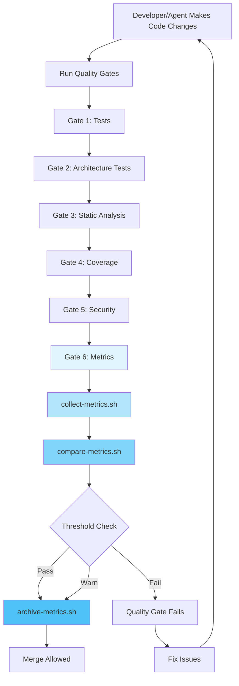

# Metrics Guide

## Overview

The SDLC agents track architectural metrics over time to prevent AI-assisted technical debt. Metrics are collected automatically during quality gates and stored historically for trend analysis.

## When Metrics Are Collected



## Execution Scenarios

### 1. Automatic Collection (Primary)

Metrics are collected **automatically** when quality gates run:

```bash
./harness/run-quality-gates.sh
```

**Triggers:**
- ✅ Coding Agent completes a task
- ✅ CI/CD pipeline runs
- ✅ Manual verification before merge
- ✅ Feature implementation completion

**Outcome:**
- Metrics collected → compared → archived
- Warnings logged but don't block merge
- Failures block merge

---

### 2. Manual Collection

Developers can manually check metrics:

```bash
cd agent-context
../harness/collect-metrics.sh

# View current metrics
cat metrics/current.json

# Compare against thresholds
../harness/compare-metrics.sh
```

**Use Cases:**
- Quick health check
- Debugging complexity issues
- Understanding project state
- Before starting major refactoring

---

### 3. Agent Workflows

#### Coding Agent Flow
```
1. Implement feature/fix
2. Run unit tests
3. Run ./harness/run-quality-gates.sh  ← Metrics collected here
4. If metrics fail, refactor and retry
5. Mark task complete
```

#### Architect Agent Flow
```
1. Review feature plan
2. Collect baseline metrics (optional)
3. Approve/reject based on structural debt
4. Update thresholds if project evolves
```

#### Retro Agent Flow
```
1. Run collect-metrics.sh
2. Compare with historical snapshots
3. Identify trends (e.g., "files grew 20% this sprint")
4. Add findings to learning playbook
5. Recommend threshold adjustments
```

---

## What Gets Tracked

### Architecture Metrics
| Metric | Threshold | Why It Matters |
|--------|-----------|----------------|
| Total files | 500 | Prevents unbounded growth |
| Directory depth | 6 levels | Maintains navigability |
| Files per directory | 50 | Prevents overstuffed folders |

### Coupling Metrics
| Metric | Threshold | Why It Matters |
|--------|-----------|----------------|
| Circular dependencies | 0 | Enforces clean architecture |
| Architecture violations | 0 | Maintains layer boundaries |
| Dependencies per module | 10 | Prevents tight coupling |

### Test Metrics
| Metric | Threshold | Why It Matters |
|--------|-----------|----------------|
| Test coverage | 70% min | Ensures adequate testing |
| Test-to-code ratio | 0.5 min | Prevents untested code growth |

### Cyclomatic Complexity Metrics (Lizard)

> **Optional Tool**: Install with `pip install lizard` or `pipx install lizard`

| Metric | Threshold | Why It Matters |
|--------|-----------|----------------|
| Max cyclomatic complexity | 15 | Functions >15 are hard to test and maintain |
| Avg cyclomatic complexity | <6 | Indicates overall code simplicity |
| Functions over CCN 15 | 5 max | Limit number of complex functions |
| Max function length | 50 lines | Long functions are hard to understand |

**CCN (Cyclomatic Complexity Number) Interpretation:**
- **1-5**: Simple, low risk
- **6-10**: Moderate complexity, acceptable
- **11-15**: High complexity, consider refactoring
- **16+**: Very high complexity, refactor recommended

**Installation:**
```bash
# Option 1: pipx (recommended, isolated environment)
brew install pipx
pipx install lizard

# Option 2: pip with user flag
pip3 install --user lizard

# Verify installation
lizard --version
```

---

## Understanding the Output

### Collection Output
```
[metrics] Detected stack: java
[metrics] Collecting universal metrics...
[metrics]   Total files: 70
[metrics]   Total directories: 30
[metrics]   Max directory depth: 3
[metrics] Collecting cyclomatic complexity metrics...
[metrics]   Average cyclomatic complexity: 3.42
[metrics]   Max cyclomatic complexity: 12
[metrics]   Functions over CCN 15: 0
[metrics]   Average function length (NLOC): 15.28
[metrics]   Max function length (NLOC): 45
[metrics] Collecting Java/Kotlin metrics...
[metrics]   Circular dependencies: 0
[metrics]   Architecture violations: 0
[metrics] ✓ Metrics written to: agent-context/metrics/current.json
```

### Comparison Output
```
[metrics] Threshold Comparison:
[metrics]   ✓ Total files: 70 / 500 (14%)
[metrics]   ✓ Directory depth: 3 / 6
[metrics]   ✓ Max cyclomatic complexity: 12 (threshold: 15)
[metrics]   ✓ High complexity functions: 0
[metrics]   ⚠ Total files: 420 / 500 (84% - approaching limit)
[metrics]   ✗ Circular dependencies: 2 (EXCEEDS threshold of 0)

[metrics] Trend Analysis:
[metrics]   ↑ Total files: +5 since last snapshot (+7%)
[metrics]   → Directory depth: stable
[metrics]   ✓ PASSED: All metrics within acceptable ranges
```

**Symbols:**
- ✓ = Within threshold (good)
- ⚠ = Approaching threshold (warning, 80-100%)
- ✗ = Exceeds threshold (failure)
- ↑ = Increasing trend
- ↓ = Decreasing trend
- → = Stable/unchanged

---

## Viewing Historical Trends

### List All Snapshots
```bash
ls -lt agent-context/metrics/history/
# 2025-12-12-091518.json
# 2025-12-11-143022.json
# 2025-12-10-095511.json
```

### Compare Two Snapshots
```bash
# View current
cat agent-context/metrics/current.json | grep total_files

# View snapshot from yesterday
cat agent-context/metrics/history/2025-12-11-*.json | grep total_files

# Calculate delta manually or use jq
```

### Generate Trend Report (Manual)
```bash
# Extract total_files from all snapshots
for f in agent-context/metrics/history/*.json; do
    echo -n "$(basename $f): "
    grep -oP '"total_files":\s*\K\d+' "$f"
done
```

---

## Updating Thresholds

Thresholds should evolve with your project. Update `agent-context/metrics/thresholds.json`:

```json
{
  "architecture_metrics": {
    "files": {
      "max_total_files": 500,  ← Increase for larger projects
      "warn_threshold_percent": 80
    }
  }
}
```

**When to Update:**
- Project grows beyond initial estimates
- Switching to monorepo structure
- Adding new major features
- Team consensus on new standards

**Best Practice:** Document changes in commit messages:
```
chore: increase max_total_files threshold to 1000

Project has grown to 850 files across 3 major features.
Threshold increase approved in retro meeting.
```

---

## Troubleshooting

### Metrics Not Collecting
```bash
# Check if script exists
ls -la harness/collect-metrics.sh

# Run manually to see errors
./harness/collect-metrics.sh

# Check permissions
chmod +x harness/collect-metrics.sh
```

### Thresholds Not Loading
```bash
# Verify thresholds.json exists
cat agent-context/metrics/thresholds.json

# Validate JSON syntax
python3 -m json.tool agent-context/metrics/thresholds.json
```

### False Positives
```bash
# Check what files are being counted
find . -type f \
    -not -path "*/node_modules/*" \
    -not -path "*/.git/*" \
    -not -path "*/target/*" | wc -l

# Adjust exclusions in collect-metrics.sh if needed
```

---

## Integration with CI/CD

### GitHub Actions Example
```yaml
- name: Run Quality Gates
  run: |
    cd agent-context
    ../harness/run-quality-gates.sh
  
- name: Upload Metrics
  uses: actions/upload-artifact@v3
  with:
    name: metrics
    path: agent-context/metrics/current.json
```

### GitLab CI Example
```yaml
quality-gates:
  script:
    - cd agent-context
    - ../harness/run-quality-gates.sh
  artifacts:
    paths:
      - agent-context/metrics/current.json
    expire_in: 30 days
```

---

## Best Practices

### ✅ Do
- Run quality gates before every merge
- Review metrics trends during retros
- Update thresholds when project evolves
- Archive snapshots before major refactorings
- Use warnings as early indicators

### ❌ Don't
- Disable metrics checks to "move faster"
- Set thresholds unrealistically low
- Ignore warning trends
- Delete historical snapshots
- Skip metrics for "small changes"

---

## Agent Responsibilities

| Agent | Responsibility | When |
|-------|---------------|------|
| **Coding Agent** | Run quality gates (including metrics) | Before task completion |
| **Architect Agent** | Review metrics after features, update thresholds | During feature review |
| **Retro Agent** | Analyze trends, identify debt, recommend actions | Sprint retrospectives |
| **Curator Agent** | Archive old metrics, clean up history | Weekly/monthly |

---

## FAQ

**Q: Why do metrics run on every quality gate?**  
A: To catch complexity creep early. It's easier to fix 5 new files than 500.

**Q: What if metrics fail but I need to merge urgently?**  
A: Metrics failures indicate architectural violations. Either fix them or document as intentional debt. Don't bypass.

**Q: How long are snapshots kept?**  
A: Last 30 snapshots by default. Configurable in `archive-metrics.sh`.

**Q: Can I track custom metrics?**  
A: Yes! Edit `collect-metrics.sh` to add project-specific metrics to the JSON output.

**Q: Do warnings block merges?**  
A: No. Warnings (80-100% of threshold) are informational. Only failures (>100%) block merges.

---

## See Also

- [Stack Detection](../agents/skills/stack-detection.md)
- [Quality Gates Script](../agents/templates/harness/run-quality-gates.sh)
- [Agent Architecture](./AGENT_ARCHITECTURE.md)
- [Harness Documentation](./templates/harness/README.md)
